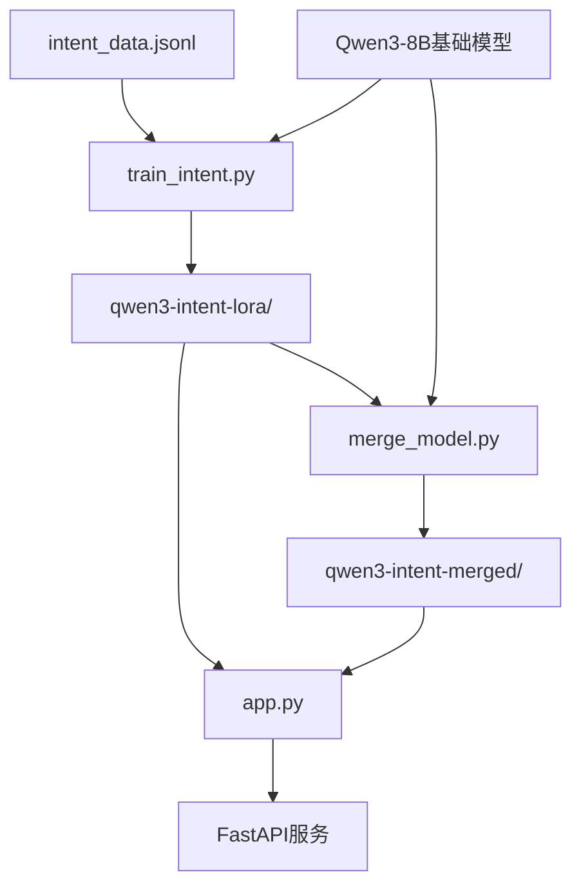

# Qwen3意图识别项目结构说明文档

## 项目概述

本项目是一个基于Qwen3-8B模型的意图识别系统，使用LoRA（Low-Rank Adaptation）技术进行微调，并提供FastAPI接口服务。项目支持自然语言文本的意图分类，可识别多种用户意图如退票、查询余额、航班预订等。

## 项目目录结构

```
project2_1/
├── app.py                    # FastAPI应用主文件，提供意图识别API服务
├── train_intent.py          # 模型训练脚本，使用LoRA微调Qwen3模型
├── merge_model.py           # 模型合并脚本，将LoRA适配器与基础模型合并
├── data/                    # 数据目录
│   └── intent_data.jsonl    # 意图识别训练数据集（JSONL格式）
├── 项目描述.txt             # 项目基本描述和使用说明
└── 项目结构说明文档.md      # 本文档
```

## 核心文件功能详解

### 1. app.py - API服务模块

**主要功能：**
- 提供基于FastAPI的意图识别Web服务
- 加载训练好的LoRA模型进行推理
- 支持健康检查和意图列表查询

**核心组件：**
- `IntentRequest/IntentResponse`: 请求和响应数据模型
- `load_model_and_tokenizer()`: 模型和分词器加载函数
- `predict_intent()`: 意图识别预测端点
- `health_check()`: 服务健康检查端点

**API端点：**
- `GET /`: 根路径，返回API基本信息
- `GET /health`: 健康检查，返回模型加载状态
- `POST /predict`: 意图识别预测
- `GET /intents`: 获取所有可用意图类别

### 2. train_intent.py - 模型训练模块

**主要功能：**
- 使用LoRA技术微调Qwen3-8B模型
- 处理JSONL格式的训练数据
- 支持模型量化和梯度检查点

**核心组件：**
- `preprocess_function()`: 数据预处理函数
- `compute_metrics()`: 模型评估指标计算
- `main()`: 主训练流程，包含数据加载、模型配置、训练执行

**训练配置：**
- LoRA参数：rank=16, alpha=32, dropout=0.1
- 训练参数：batch_size=4, learning_rate=5e-5, epochs=3
- 优化器：AdamW with cosine学习率调度

### 3. merge_model.py - 模型合并模块

**主要功能：**
- 将LoRA适配器与基础模型合并
- 保存完整的合并模型用于部署
- 支持命令行参数配置

**核心组件：**
- `validate_paths()`: 路径验证函数
- `load_label_mapping()`: 标签映射加载函数
- `merge_lora_model()`: 模型合并主函数
- `main()`: 命令行接口处理

**输出文件：**
- 合并后的模型权重文件
- 分词器配置文件
- 标签映射文件
- 合并信息记录文件

### 4. data/intent_data.jsonl - 训练数据集

**数据格式：**
```json
{"text": "我要退票", "intent": "ticket_refund"}
{"text": "查询余额", "intent": "account_balance"}
{"text": "预订航班", "intent": "flight_booking"}
```

**数据特点：**
- JSONL格式，每行一个JSON对象
- 包含100条高质量训练样本
- 覆盖18种不同意图类别
- 支持中文自然语言输入

## 运行流程

### 环境准备

1. **Python环境要求：**
   ```bash
   Python >= 3.10
   CUDA >= 11.8 (GPU训练)
   ```

2. **依赖包安装：**
   ```bash
   pip install torch transformers datasets peft accelerate
   pip install fastapi uvicorn scikit-learn
   ```

3. **硬件要求：**
   - 训练：22GB+ GPU显存（推荐A10/V100/A100）
   - 推理：8GB+ GPU显存或CPU运行

### 完整执行流程

#### 步骤1：模型训练
```bash
# 执行LoRA微调训练
python train_intent.py

# 训练输出：
# - ./qwen3-intent-lora/: LoRA适配器文件
# - ./qwen3-intent-lora/label_mapping.json: 标签映射文件
```

**训练过程监控：**
- 训练日志实时显示loss和accuracy
- 自动保存最佳模型检查点
- 支持断点续训功能

#### 步骤2：模型合并（可选）
```bash
# 合并LoRA适配器与基础模型
python merge_model.py

# 可选参数：
python merge_model.py --lora_path ./qwen3-intent-lora \
                     --base_model Qwen/Qwen3-8B \
                     --output_path ./qwen3-intent-merged \
                     --verbose

# 输出：
# - ./qwen3-intent-merged/: 完整合并模型
```

#### 步骤3：启动API服务
```bash
# 启动FastAPI服务
python app.py

# 或使用uvicorn启动
uvicorn app:app --host 0.0.0.0 --port 8000 --reload
```

**服务启动信息：**
- 服务地址：http://localhost:8000
- API文档：http://localhost:8000/docs
- 健康检查：http://localhost:8000/health

#### 步骤4：API测试
```bash
# 测试意图识别
curl -X POST "http://localhost:8000/predict" \
     -H "Content-Type: application/json" \
     -d '{"text": "我要退票"}'

# 预期响应
{
  "text": "我要退票",
  "intent": "ticket_refund",
  "confidence": 0.95
}
```

## 模块依赖关系



**依赖说明：**
1. **数据依赖：** 训练脚本依赖JSONL格式的训练数据
2. **模型依赖：** 所有脚本都依赖Qwen3-8B基础模型
3. **文件依赖：** API服务依赖训练产生的LoRA适配器或合并模型
4. **运行时依赖：** 各模块间通过文件系统共享模型和配置

## 配置指南

### 1. 训练配置优化

**LoRA参数调整：**
```python
# 在train_intent.py中修改
lora_config = LoraConfig(
    r=16,              # rank: 4-64，越大模型容量越大
    lora_alpha=32,     # alpha: 通常为rank的2倍
    lora_dropout=0.1,  # dropout: 0.05-0.2
    target_modules=["q_proj", "v_proj", "k_proj", "o_proj"]
)
```

**训练参数调整：**
```python
training_args = TrainingArguments(
    per_device_train_batch_size=4,    # 根据GPU显存调整
    learning_rate=5e-5,               # 学习率：1e-5到1e-4
    num_train_epochs=3,               # 训练轮数：2-5
    warmup_ratio=0.1,                 # 预热比例
    save_strategy="epoch",            # 保存策略
)
```

### 2. 推理配置优化

**模型量化配置：**
```python
# 在app.py中启用INT8量化
from transformers import BitsAndBytesConfig

quantization_config = BitsAndBytesConfig(
    load_in_8bit=True,
    llm_int8_threshold=6.0
)

base_model = AutoModelForSequenceClassification.from_pretrained(
    model_name,
    quantization_config=quantization_config,
    device_map="auto"
)
```

**批处理优化：**
```python
# 支持批量预测
@app.post("/predict_batch")
async def predict_batch(requests: List[IntentRequest]):
    # 批量处理逻辑
    pass
```

### 3. 部署配置

**Docker部署：**
```dockerfile
FROM python:3.9-slim
WORKDIR /app
COPY requirements.txt .
RUN pip install -r requirements.txt
COPY . .
EXPOSE 8000
CMD ["uvicorn", "app:app", "--host", "0.0.0.0", "--port", "8000"]
```

**生产环境配置：**
```bash
# 使用Gunicorn部署
pip install gunicorn
gunicorn app:app -w 4 -k uvicorn.workers.UvicornWorker --bind 0.0.0.0:8000
```

## 性能优化建议

### 1. 训练优化
- **梯度累积：** 在显存不足时使用梯度累积增加有效batch size
- **混合精度：** 启用fp16训练减少显存占用
- **数据并行：** 多GPU训练时使用DataParallel或DistributedDataParallel

### 2. 推理优化
- **模型量化：** 使用INT8量化减少显存占用
- **批处理：** 支持批量预测提高吞吐量
- **缓存机制：** 对常见查询结果进行缓存

### 3. 系统优化
- **异步处理：** 使用异步IO提高并发性能
- **负载均衡：** 多实例部署配合负载均衡器
- **监控告警：** 集成Prometheus和Grafana监控系统状态

## 故障排除

### 常见问题及解决方案

1. **CUDA内存不足：**
   ```python
   # 减少batch_size或启用梯度检查点
   training_args.gradient_checkpointing = True
   training_args.per_device_train_batch_size = 2
   ```

2. **模型加载失败：**
   ```python
   # 检查模型路径和权限
   if not os.path.exists(model_path):
       raise FileNotFoundError(f"模型路径不存在: {model_path}")
   ```

3. **API响应超时：**
   ```python
   # 增加超时时间或启用异步处理
   @app.post("/predict")
   async def predict_intent(request: IntentRequest):
       # 异步处理逻辑
   ```

## 扩展开发

### 1. 添加新意图类别
1. 在`intent_data.jsonl`中添加新的训练样本
2. 重新训练模型：`python train_intent.py`
3. 更新API服务中的标签映射

### 2. 集成其他模型
```python
# 支持多模型切换
MODEL_CONFIGS = {
    "qwen3-8b": "Qwen/Qwen3-8B",
    "qwen3-7b": "Qwen/Qwen3-7B",
    "chatglm3-6b": "THUDM/chatglm3-6b"
}
```

### 3. 添加数据增强
```python
# 在train_intent.py中添加数据增强
from nlpaug import AugmenterFactory

def augment_data(texts, labels):
    # 数据增强逻辑
    pass
```

## 版本信息

- **项目版本：** 1.0.0
- **Qwen3模型版本：** Qwen3-8B
- **Python版本要求：** >= 3.8
- **主要依赖版本：**
  - transformers >= 4.35.0
  - torch >= 2.0.0
  - fastapi >= 0.104.0
  - peft >= 0.6.0

## 联系信息

如有问题或建议，请通过以下方式联系：
- 项目仓库：[GitHub链接]
- 技术文档：[文档链接]
- 问题反馈：[Issue链接]

---

*最后更新时间：2024年12月*